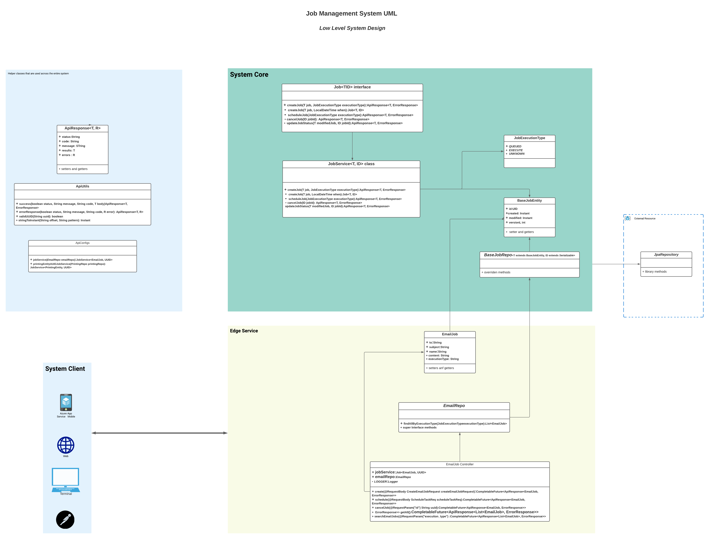

# Payoneer Jobs Management System


Welcome to Payoneer Jobs Management System.<br/>
in this document, you will have a technical overview of how to use the system.<br/>

## Content of Document

1. [Important](#important)
2. [Overview](#overview)
3. [How To Build](#how-to-build)
4. [How To Use](#how-to-use)
5. [Usage](#usage)
6. [API](#api)
7. [End Points](#endpoints)
8. [Error Handling](#error-handling)
9. [Testing](#testing)
10. [UML Design](#uml-design)
11. [Copyrights](#copyrights)

## important

* Please note that the system is just to give you an overview of the available skills.
* Please keep in mind that some functions, deployments ideas are just for demonstration purposes while its close to
  production(not production yet).
* Please note that some functions have been developed to make the system work and are not fully ready to be a production
  system ex: (JobExecution Types)
  are limited for testing only and are available to test only internally(ENUM) Class and not available to check without
  sources like database or properties file.
* due to the small window of time that I have, I hope I can give you ideas about what you're looking for from doing this
  test.
* all unit tests have been provided in the test package.
* a RESTFul Interface is available along with a rest collection available to import directly to postman.
* the system is Docker ready, you can find more information below.
* the system can be imported directly to Java IDEs Like(IntelliJ).
* the system is using an in-memory Store (H2 database) engine for simplicity, while you can use any RDBMS System like
  MySQL.

## Overview

Payoneer's management system has been developed to perform unknown task types. jobs may be ready for direct
execution<br/>
or they are queued for future execution.<br/>
Payoneer's management system is using Java 16, Spring Boot, Hibernate, Spring JPA, Docker, and H2 Database in its
core.<br/>
Payoneer's management system was design to be highly compatible with any Client (Mobile, Web) while its using RESTFul
Interface to interact with the outer world.<br/>
Payoneer's management system is flexible and upgradable beacuse it uses java interfaces and high level support to add
new features and components<br/>
is just like there is a new fature coming in, extends the old interface and boom.<br/>
Payoneer's management systemis built to be a non-blocking Code, using Functional programming in its core. Async RESTFul
APIs is what this system is all about

## how to build

* [Docker](#docker)
* [Gradle](#gradle)

### docker

to build the image just use the following command

```docker
docker build -t payoneer_germany/job_management .
```

to run it

```command
docker run -it -p30000:30000 payoneer_germany/job_management:latest
```

### gradle

first make sure we are clean.

```command
gradle clean 
```

then build it.

```command
gradle build
```

to run it

```command
java -jar JobManagement-1.0.101.jar
```

> note: please check the logs they have enough information about what is happening in the system

## how to use

* the system api is quit simple and straight forward<br/>
  we have an interface that represents the entry point for the entire System, it's
  Called[Job](src/main/java/com/payoneer/JobManagement/system/Job.java) <br/>
  before digging in with getting our hands dirty let's first take a look of few thing that are required<br/>
    * the system is built on top of Spring boot we need to define `beans` to use them in our controllers.

    * all of our entity classes must extend
      the [JobBaseEntity](src/main/java/com/payoneer/JobManagement/domain/entities/BaseJobEntity.java) class to be valid
      to us in our system
    * our entity repository must extend
      the [BaseJobRepo](src/main/java/com/payoneer/JobManagement/domain/repos/BaseJobRepo.java) to be valid.

* now we are ready let's jump in<br/>
  __we will start by creating an Entity for our Job__

1. to create a job, create a simple class that
   extends  [JobBaseEntity](src/main/java/com/payoneer/JobManagement/domain/entities/BaseJobEntity.java) like the
   following

```java

@Entity
@Table(name = "emails")
public class EmailJob extends BaseJobEntity {
    // code here
    // columns ...etc.
}
```

2. create a repository.

```java

@Repository
public interface EmailRepo extends BaseJobRepo<EmailJob, UUID> {
    // code here.
    // repo methods here.
}
```

3. let create our first bean. to have a valid and usable objects

```java
 @Bean
public JobService<EmailJob, UUID> jobService(EmailRepo emailRepo){
        return new JobService<>(emailRepo);
        }
```

> using this bean will initialize the system and pass the entity along with its repository to it.

### now we're ready to go.

let's get our hands dirty with the code.<br/>
now we can use the system easily, we will start that by creating our fist controller. as mentioned in the overview the
system has a RESTFul Interface.<br/>
**we will now create our rest controller.**<br/>

### creating the controller

simple Spring boot Controller is what we are doing in here.

```java

@RestController
@RequestMapping("api/v1/job")
public class JobsController {
// code here
}
```

we will autowire the previous object in this controller to have access to the System.

```java
private final Job<EmailJob, UUID> jobService;
private final EmailRepo emailRepo;
```

you will have now access using the [JobService](src/main/java/com/payoneer/JobManagement/system/JobService.java).

### usage

the system contains useful methods that can be chained to perform a task, either the job should be executed directly or
queued.<br/>
its quit simple as we will go through that in a sec.<br/>

1. to create and process a simple task you just need to
   call  [createJob(emailJob,executionType, jobPriority)](src/main/java/com/payoneer/JobManagement/system/JobService.java#L133-L147)
   and boom.

```java
 // create an object and pass it to the system
var emailJob=new EmailJob(
        UUID.randomUUID(),
        Instant.now(),
        createEmailJobRequest.getEmailJob().getTo(),
        createEmailJobRequest.getEmailJob().getSubject(),
        createEmailJobRequest.getEmailJob().getName(),
        createEmailJobRequest.getEmailJob().getContent(),
        executionType,
        jobPriority
        );
// execute it using:
        jobService.createJob(emailJob,executionType,jobPriority)

```

> please note that `createEmailJobRequest` is a POJO Class that is used by the rest endpoint to pass json object to the system

json snippet:

```swagger codegen
{
    "emailJob": {
        "to": "ferasawady@gmail.com",
        "subject": "email job",
        "name": "Feras Alawadi",
        "content": "hello this is just a demo of Payoneer Germany Job Management System."
    },
    "executionType": "execute",
    "jobPriority": "high"
}
``` 

2. to schedule a task please use the following
   method  [createJob(emailJob, LocalDateTime, jobPriority)](src/main/java/com/payoneer/JobManagement/system/JobService.java#L184-L221)
   <br/> please note that the method in here is chained in the order createJob() then schedule mess with the order will
   lead the system to fail and throw error

```java
  // create a job object
 var emailJob=new EmailJob(
         UUID.randomUUID(),
         Instant.now(),
         scheduleTaskReq.getEmailJob().getTo(),
         scheduleTaskReq.getEmailJob().getSubject(),
         scheduleTaskReq.getEmailJob().getName(),
         scheduleTaskReq.getEmailJob().getContent(),
         executionType,
         jobPriority
         );
// execute it
         jobService.createJob(emailJob,scheduleTaskReq.getWhen(),jobPriority).scheduleJob(executionType)
```

> please note to have a valid scheduled task a proper date should be passed of pattern: 2021-09-10T14:30:00

a json snippet

```swagger codegen
{
    "when": "2021-09-10T14:30:00",
    "emailJob": {
        "to": "ferasawady@gmail.com",
        "subject": "email job",
        "name": "Feras Alawadi",
        "content": "hello this is just a demo of Payoneer Germany Job Management System."
    },
    "executionType": "QUEUED",
    "jobPriority": "high"
}
```

3. cancel a job<br/>
   job can be canceled easily by calling the `cancelJob(id)` method. check it
   here [cancelJon(ID id)](src/main/java/com/payoneer/JobManagement/system/Job.java#L50-L61)

```java
jobService.cancelJob(UUID.fromString(uuid))
```

> please note that to have a valid operation a valid UUID must be passed.

the system already have a Utils Class that have useful methods to help with this obviously<br/>
> please see [ApiUtils](src/main/java/com/payoneer/JobManagement/api/utils/ApiUtils.java) for more info

to validate the id you can call the
method [validUUID(uuid)](src/main/java/com/payoneer/JobManagement/api/utils/ApiUtils.java#L70-L83) passing the id to it
to check if It''s valid or not.

> [JobExecutionType](src/main/java/com/payoneer/JobManagement/api/enums/JobExecutionType.java) and [JobPriority](src/main/java/com/payoneer/JobManagement/api/enums/JobPriority.java) are enum classes that contains at least one layer of usage (minimum). please refer to them for more info

### API

the schema of the API is simple and providing a generic shape that can be used to help front end programmers to perform
the tasks faster by having one wrapper to the json<br/>
in fact what changing in here is the body of the results object, to make this clear let's take a look on some samples.

```swagger codegen
{
    "status": true,
    "code": "SUCCESS",
    "message": "job has been scheduled successfully",
    "results": {
        "id": "48980659-c876-4dd7-9e32-dd17943c7777",
        "created": "2021-09-10T17:15:55.543108200Z",
        "modified": null,
        "version": 1,
        "to": "ferasawady@gmail.com",
        "subject": "email job",
        "name": "Feras Alawadi",
        "content": "hello this is just a demo of Payoneer Germany Job Management System.",
        "executionType": "QUEUED"
    },
    "errors": null
}

```

as you can see the results object is what changing in here each time it has new data depending on what nd point you are
calling.

```swagger codegen
{
    "status": false,
    "code": "FAIL",
    "message": "job has can't be Canceled",
    "results": null,
    "errors": {
        "errorMessage": "job: { 1aa749aa-4171-4798-b3c2-5f36c008e95b } can't be canceled because it might already proceed or canceled already ",
        "errorCode": "FAIL"
    }
}
```

in here we have an error object while the results has a null value.
> please note that `status`, `code`, `message` `results` `errors` are always there in the response

the error object have a fixed shape

```swagger codegen
 "errors": {
        "errorMessage": "...",
        "errorCode": "..."
    }
```

in conclusion: the value of `results` is changing only so the developers need to deal with what it contains.

### endpoints

the url scheam is straight forward as well

```http request
 URL/api/{version}/group
 ```

for example:

```http request
http://localhost:30000/api/v1/job
```

### error handling

the system is trying its best to deal with all edge cases and unkown user behaviour, by response back with error codes
to the client instaed of throwing API Error codes <br/>
`4xx` and `5xx`, keep in mind is some cases the systes must fail to protect the data and the warehouse.<br/>
in this case the system is logging all the things that happens, please refer to the logs to have an idea about the error
codes that appears.<br/>

**  the idea behind throwing errors **<br/>

1. is that the system will print the error but will continue to function normally.
2. otherwise, normal errors will be returned to the cliend as API responses.

### Testing

* the system is already have a Testing REST Interface.
* there is a unit test in the test package that can be used.

1. the current system is equipped with the following testing endpoints

| URL                                                                       | usage                 |  Method               |
| --------------------------------------------------------------------------| --------------------- | --------------------- |
| http://localhost:30000/api/v1/job                                         | Create a Job Task     | POST                  |
| http://localhost:30000/api/v1/job/sc                                      | Schedule a Task       | POST                  |
| http://localhost:30000/api/v1/job?id=1aa749aa-4171-4798-b3c2-5f36c008e95b | cancel a task         | DELETE                |
| http://localhost:30000/api/v1/job/query?execution_type=EXECUTE            | search for data       | GET                   |
| http://localhost:30000/api/v1/job                                         | load all tasks        | GET                   |

<sup>1</sup>

2. unit test is available at the test package that contains tests for the system methods.

### UML Design



### copyrights

<footer>
<p style="float:left; width: 20%;">
Copyright © Payoneer Germany 2021
</footer>